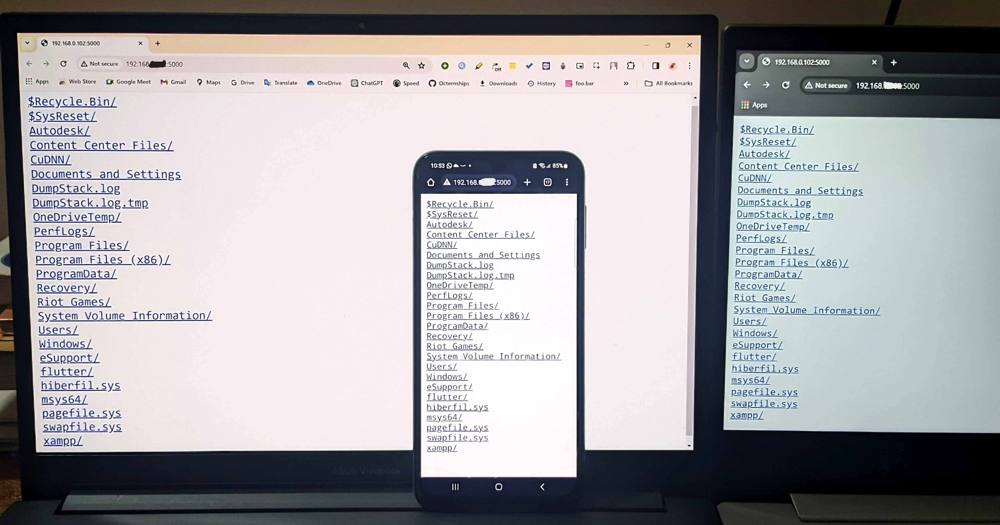
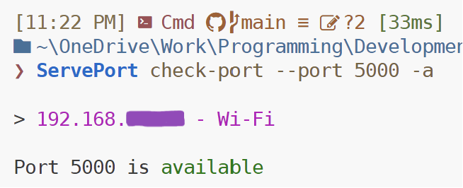
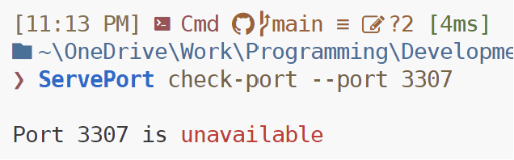
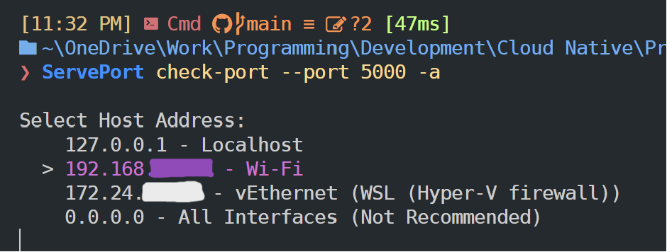
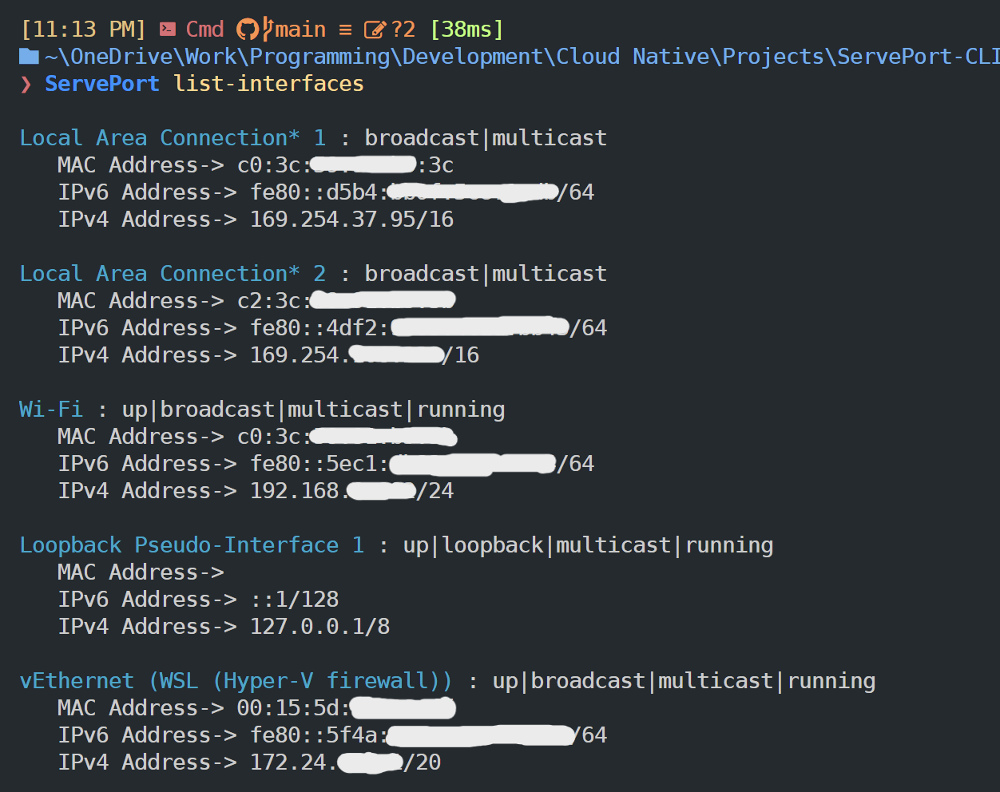

<p align="center">
  <h1 align="center">ServePort - CLI</h1>

  <p align="center">
    A convenient CLI tool for Spawning Simple File Servers over multiple Networks, and managing Ports, IP-Addresses & Network Interfaces.
  </p>
</p>

<details open="open">
  <summary>Table of Contents</summary>
  <ol>
    <li>
      <a href="#about-the-project">About The Project</a>
    </li>
    <li><a href="#tech-used">Technologies Used</a></li>
    <li><a href="#usage">Usage</a></li>
    <li><a href="#setup">Setup Project</a>
      <ul>
        <li><a href="#pre-requisites">Pre-requisites</a></li>
        <li><a href="#running-the-project">Running the project</a></li>
      </ul></li>
  </ol>
</details>

<h3 id="about-the-project">• About The Project</h3>

**ServePort** is a simple CLI tool to Control & Manage Servers, Ports & Network Devices.

- Boot up Static Servers over Local, Private & Public Networks allowing you to share your files with ease.
  

<p align="center"><i>A Private Server over Home Wifi</i></p>

- Check Port Availability on different IP-Addresses.


 

- Lists all Network Interfaces on your machine along with their MAC, IPv4 & IPv6 Addresses.
  
 

- Highly configurable commands using Flags & Arguments


- Access Helpful CLI Documentation using `--help` or `-h` on any of the commands.


<h3 id="tech-used">• Technologies Used</h3>

- Go
- Cobra Framework
- Shell
  
<h3 id="usage">• Usage</h3>

Check [Releases](https://github.com/Snehil-Shah/ServePort-CLI/releases) for installation Instructions

The executable has three commands.

You can execute a command in the format:
 `ServePort [command] [-flag] [flagValue]`

 Flags can help you configure the command for specific usage. They are optional & you can just run the command without Flags for default usage.

 *`-h`/`--help` Flag can be toggled upon any command or directly on the executable to get meaningful documentation.*

 


**WARNING**: Make sure you trust the Private or Public network you are serving over.
Strictly avoid Serving over Public Networks like Public Wifi's as you are more vulnerable to Unrestricted Access to your Server
-> It's recommended to stick to `Localhost` for most menial tasks!

#### Commands

- `serve`: Starts a quick HTTP Server with configurable Port, Directory & Host Address

  

   *Flags*-
    
    - `-p`/`--port`: Enter Port to start the server on. (defaults to 80) - Integer
    - `-d`/`--directory`: Enter Directory to serve. (defaults to current dir) - String
    - `-a`/`--address`: Select Server Host.
     This is a toggle flag and doesn't need input.
     (If flag not present, defaults to Localhost)

- `check-port`: Checks availability of a Port on any Host.

  

   *Flags*-
    
    - `-p`/`--port`: Enter Port to check. (defaults to 80) - Integer
    - `-a`/`--address`: Select Port Host.
     This is a toggle flag and doesn't need input.
     (If flag not present, defaults to Localhost)

- `list-interfaces`: Lists out all Network interfaces along with their MAC, IPv4 & IPv6 Addresses on your Computer 

  

<h3 id="setup">• Setup Project (For Developers)</h3>

- <h4 id="pre-requisites">Pre-requisites:</h4>
  
   - [Go](https://go.dev/dl/)
   - [Cobra](https://cobra.dev/#install)

- <h4 id="running-the-project">Running the Project:</h4>
  
  Just execute the below command to run the CLI app and its commands

  ```shell
  go run main.go [command] [flags] [flag-values]
  go run main.go check-port -p 8080  #Example
  ```

  All commands are implemented inside the ```/cmd``` folder in their own files.
  ```root.go``` is the base command implementation & ```main.go``` is the entrypoint code to the app.